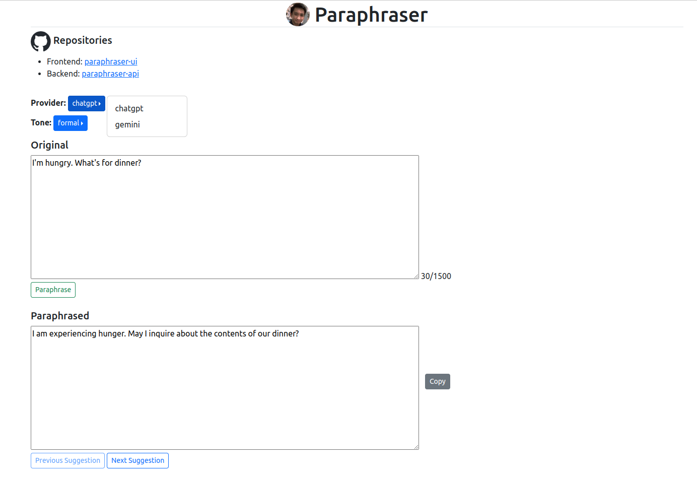

# paraphraser-ui

Minimalist frontend for [paraphraser-api](https://github.com/gkatanacio/paraphraser-api).



## Usage

#### configure

```bash
$ make .env
```

- set paraphraser-api URL in the generated `.env` file

#### install dependencies (generate `node_modules`)

```bash
$ make deps
```

#### run linter (autofix)

```bash
$ make lint
```

#### run tests

```bash
$ make test
```

#### start development server

```bash
$ make dev
```

#### build distributable artifacts (generate `dist`)

```bash
$ make build
```

### If to be deployed as a [static website hosted in S3](https://docs.aws.amazon.com/AmazonS3/latest/userguide/WebsiteHosting.html) and [served using CloudFront](https://docs.aws.amazon.com/AmazonCloudFront/latest/DeveloperGuide/DownloadDistS3AndCustomOrigins.html#concept_S3Origin_website):

**Note:** This requires an existing S3 bucket with static website hosting settings properly configured and a CloudFront distribution with its origin set to the S3 static website.

#### configure AWS

```bash
$ make .env.aws
```

- set appropriate values in the generated `.env.aws` file

#### deploy to AWS

```bash
$ make deploy
```

- requires a built `dist` folder (i.e., run `make build` first)
- utilizes [aws-cli](https://hub.docker.com/r/amazon/aws-cli) Docker image
